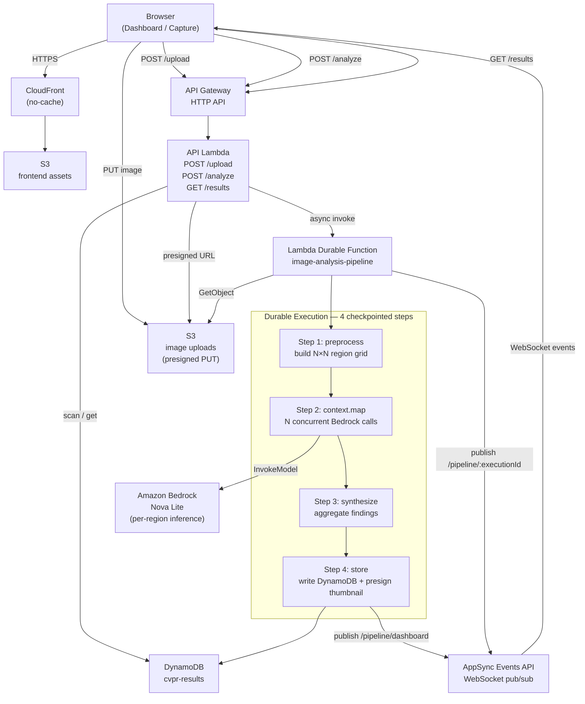

# Image Analysis Orchestration

A CVPR 2026 booth demo showing how **AWS Lambda Durable Functions** map directly onto production computer-vision pipelines. Users scan a QR code, submit an image from their phone, and watch a 4-step durable pipeline fan out across a 3×3 grid of concurrent Bedrock Nova invocations in real time on a shared display.

## What this demo shows

The core insight: CV researchers already think in pipelines — data loading, augmentation, inference, postprocessing. The problem when productionising is exactly what durable functions solve: multi-step workflows that survive partial failures without restarting from scratch.

`context.map()` maps directly to batch inference. Each region is an independent, checkpointed Lambda invocation. If one fails, only that region retries. The checkpoint/replay model is visible — you can kill a step mid-execution and watch it resume.

---

## Architecture



### Request flow

1. **Upload** — Browser calls `POST /upload` → gets a presigned S3 PUT URL + `executionId`. Image goes directly to S3 (never through Lambda).
2. **Trigger** — Browser calls `POST /analyze` with the S3 key. API Lambda fires the pipeline asynchronously and returns AppSync connection details immediately.
3. **Subscribe** — Browser opens a WebSocket to AppSync Events, subscribes to `/pipeline/:executionId`. Step and region events stream in as the pipeline progresses.
4. **Pipeline** runs as a durable function:
   - `preprocess` — builds region grid, publishes `step.done`
   - `context.map()` — fans out N concurrent Bedrock calls, each checkpointed; publishes a `region.done` event per finding
   - `synthesize` — aggregates all findings into a scene description with CV insights
   - `store` — writes to DynamoDB with a presigned thumbnail URL; publishes to `/pipeline/dashboard`
5. **Dashboard** — subscribes to `/pipeline/dashboard`; new result cards appear live without polling.

---

## Project structure

```
.
├── template.yaml                        # SAM template — all AWS infrastructure
├── samconfig.toml                       # SAM deploy config (stack name, region)
│
├── src/
│   ├── api/                             # API Lambda (upload, analyze, results)
│   │   ├── handler.ts
│   │   └── package.json
│   │
│   └── image-analysis-pipeline/        # Durable pipeline Lambda
│       ├── handler.ts                   # 4-step durable handler
│       ├── bedrock.ts                   # Bedrock Nova helpers
│       ├── events.ts                    # AppSync Events publisher
│       ├── types.ts
│       ├── handler.test.ts              # LocalDurableTestRunner tests
│       └── package.json
│
└── frontend/                           # Vue 3 + Vite SPA
    ├── src/
    │   ├── views/
    │   │   ├── DashboardView.vue        # Booth display — live image grid
    │   │   └── CaptureView.vue          # Mobile submission UI
    │   ├── components/
    │   │   └── PipelineStep.vue
    │   └── services/
    │       └── appSyncEvents.ts         # AppSync Events WebSocket client
    ├── .env                             # API endpoints (not committed)
    └── package.json
```

---

## Infrastructure (SAM)

| Resource | Purpose |
|---|---|
| `AWS::Serverless::Function` (api) | HTTP API handler — presigned URLs, pipeline trigger, results reads |
| `AWS::Serverless::Function` (pipeline) | Durable 4-step image analysis pipeline |
| `AWS::AppSync::Api` | Real-time WebSocket pub/sub (Events API, API key auth) |
| `AWS::AppSync::ChannelNamespace` | `pipeline` namespace for per-execution + dashboard channels |
| `AWS::Serverless::HttpApi` | API Gateway HTTP API with CORS |
| `AWS::S3::Bucket` (images) | Image uploads — 7-day expiry, CORS for browser PUT |
| `AWS::S3::Bucket` (frontend) | SPA assets — private, served via CloudFront OAC |
| `AWS::CloudFront::Distribution` | No-cache CDN (`CachingDisabled` policy) |
| `AWS::DynamoDB::Table` | Results store — `imageId` partition key |

---

## Prerequisites

- AWS CLI v2 configured with deploy permissions
- SAM CLI 1.153+
- Node.js 22+

---

## Deploy

```bash
# Deploy backend
sam build
sam deploy

# Deploy frontend (after backend outputs are available)
cd frontend
cp .env.example .env        # fill in values from sam deploy outputs
npm install
npm run deploy              # builds + syncs to S3
```

### Frontend `.env`

```
VITE_API_BASE=https://<api-id>.execute-api.<region>.amazonaws.com
VITE_REALTIME_ENDPOINT=https://<appsync-id>.appsync-api.<region>.amazonaws.com/event
VITE_REALTIME_WS_ENDPOINT=wss://<appsync-id>.appsync-realtime-api.<region>.amazonaws.com/event/realtime
VITE_REALTIME_API_KEY=<api-key-from-stack-output>
```

All values are in the `sam deploy` stack outputs.

---

## Local development

```bash
# Run unit tests (durable function replay model)
cd src/image-analysis-pipeline
npm install
npx jest

# Run frontend dev server
cd frontend
npm install
npm run dev     # http://localhost:5173
```

The frontend dev server points at the deployed API via `VITE_API_BASE`. There is no local Lambda emulation — the pipeline runs in AWS.

---

## Key durable functions concepts demonstrated

**Checkpoint/replay** — every `context.step()` result is persisted. If the Lambda is killed mid-execution, the next invocation replays from the last checkpoint rather than restarting.

**`context.map()`** — fans out an array of items as independent concurrent Lambda invocations, each checkpointed. This is the direct analogue of batch/tiled inference in CV pipelines.

**Partial failure tolerance** — if one region's Bedrock call fails after retries, `mapResults.succeeded()` returns the successful findings and synthesis still runs on them.

**Step output size** — durable checkpoints have a 256 KB limit per step. This demo keeps image bytes out of checkpoints by fetching from S3 inside each step and returning only a slim result.

---

## Built with

- [AWS Lambda Durable Functions](https://docs.aws.amazon.com/lambda/latest/dg/durable-functions.html)
- [Amazon Bedrock — Nova Lite](https://docs.aws.amazon.com/bedrock/latest/userguide/models-supported.html)
- [AWS AppSync Events API](https://docs.aws.amazon.com/appsync/latest/eventapi/welcome.html)
- [AWS SAM](https://aws.amazon.com/serverless/sam/)
- [Vue 3](https://vuejs.org/) + [Vite](https://vitejs.dev/)
