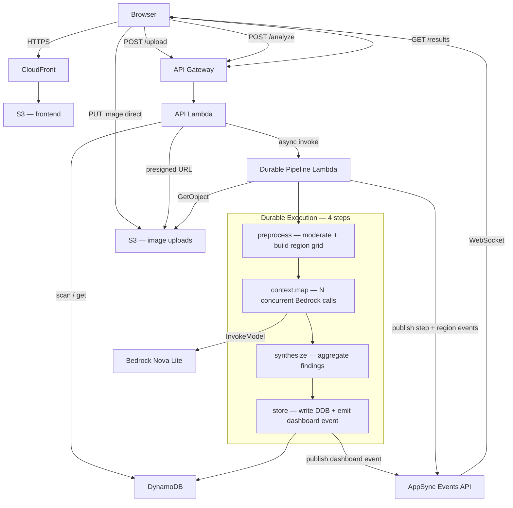

# Image Analysis Orchestration

Demonstrates how **AWS Lambda Durable Functions** map directly onto production computer-vision pipelines. Submit an image and watch a 4-step durable pipeline fan out concurrent Bedrock Nova inferences across a region grid in real time.

A live dashboard shows all submitted images with Jarvis-style bounding box overlays. Attendees at an event scan a QR code to submit their own image from a phone; results appear on the shared display within ~30 seconds.

---

## Architecture



### Request flow

1. **Upload** — Browser calls `POST /upload` → API Lambda returns a presigned S3 PUT URL + `executionId`. Image goes directly to S3 (never through Lambda).
2. **Trigger** — Browser calls `POST /analyze` with the S3 key. API Lambda fires the pipeline asynchronously and immediately returns AppSync connection details.
3. **Subscribe** — Browser opens a WebSocket to AppSync Events, subscribes to `/pipeline/:executionId`. Step and region events stream in as the pipeline progresses.
4. **Pipeline** (durable, 4 checkpointed steps):
   - `preprocess` — Nova checks image for inappropriate content, then builds the N×N region grid
   - `context.map()` — N concurrent Bedrock Nova calls, one per region, each independently checkpointed
   - `synthesize` — aggregates region findings into a full scene description with CV insights
   - `store` — persists to DynamoDB, builds a permanent CloudFront thumbnail URL, publishes to `/pipeline/dashboard`
5. **Dashboard** — subscribes to `/pipeline/dashboard`; new cards appear live without polling.

### Key durable functions concepts

| Concept | Where |
|---|---|
| **Checkpoint/replay** | Every `context.step()` result is persisted. Kill the Lambda mid-execution and it resumes from the last checkpoint. |
| **`context.map()`** | Fans out N regions as independent concurrent Lambda invocations, each checkpointed. Direct analogue of batch/tiled inference in CV. |
| **Partial failure** | `mapResults.succeeded()` returns successful findings. One failed Bedrock call retries that region only; others keep their results. |
| **Step output limit** | Durable checkpoints have a 256 KB limit. Image bytes never cross a checkpoint — each step re-fetches from S3. |
| **Determinism** | `imageFormat` is derived from the event (deterministic) and computed outside steps. `Date.now()` inside `store` is inside a step. |

---

## Project structure

```
.
├── template.yaml                        # SAM template — all AWS infrastructure
├── samconfig.toml                       # SAM deploy defaults
│
├── src/
│   ├── api/                             # API Lambda (upload, analyze, results, delete)
│   │   ├── handler.ts
│   │   └── package.json
│   │
│   └── image-analysis-pipeline/        # Durable pipeline Lambda
│       ├── handler.ts                   # 4-step durable handler
│       ├── bedrock.ts                   # Bedrock Nova helpers
│       ├── events.ts                    # AppSync Events publisher
│       ├── types.ts                     # Shared TypeScript types
│       ├── handler.test.ts              # Unit tests (LocalDurableTestRunner)
│       └── package.json
│
└── frontend/                           # Vue 3 + Vite SPA
    ├── src/
    │   ├── views/
    │   │   ├── DashboardView.vue        # Booth display — live image grid, requires auth
    │   │   ├── CaptureView.vue          # Mobile submission UI — public
    │   │   └── LoginView.vue            # Cognito login page
    │   ├── components/
    │   │   ├── PipelineStep.vue         # Step indicator component
    │   │   └── JarvisOverlay.vue        # Bounding box + HUD label overlay
    │   └── services/
    │       ├── appSyncEvents.ts         # AppSync Events WebSocket client
    │       └── auth.ts                  # Cognito USER_PASSWORD_AUTH
    ├── .env.example                     # Required env vars
    └── package.json
```

---

## Prerequisites

- **AWS CLI** v2.33+ configured with deploy permissions
- **SAM CLI** 1.153+
- **Node.js** 22+
- **AWS account** with Bedrock Nova Lite enabled in `us-east-1`

Enable Bedrock model access: AWS Console → Bedrock → Model access → Amazon Nova Lite.

---

## Deploy

### 1. Deploy backend

```bash
sam build
sam deploy --guided   # first time — writes samconfig.toml
```

Note the stack outputs — you need them for the frontend `.env`:

```
ApiBase              = https://<api-id>.execute-api.us-east-1.amazonaws.com
RealtimeEndpoint     = https://<appsync-id>.appsync-api.us-east-1.amazonaws.com/event
RealtimeWsEndpoint   = wss://<appsync-id>.appsync-realtime-api.us-east-1.amazonaws.com/event/realtime
RealtimeApiKey       = <api-key>
FrontendUrl          = https://<cloudfront-id>.cloudfront.net
FrontendBucket       = cvpr-frontend-<account-id>
UserPoolId           = us-east-1_<id>
UserPoolClientId     = <client-id>
```

### 2. Create admin user

```bash
# Replace <UserPoolId> and <UserPoolClientId> from stack outputs
USER_POOL_ID=us-east-1_XXXXXXXXX
CLIENT_ID=xxxxxxxxxxxxxxxxxxxxxxxxxx

aws cognito-idp admin-create-user \
  --user-pool-id $USER_POOL_ID \
  --username your-admin-username \
  --message-action SUPPRESS \
  --region us-east-1

aws cognito-idp admin-set-user-password \
  --user-pool-id $USER_POOL_ID \
  --username your-admin-username \
  --password 'YourPassword123!' \
  --permanent \
  --region us-east-1
```

### 3. Configure and deploy frontend

```bash
cd frontend
cp .env.example .env
# Fill in values from stack outputs
```

`.env`:
```
VITE_API_BASE=https://<api-id>.execute-api.us-east-1.amazonaws.com
VITE_REALTIME_ENDPOINT=https://<appsync-id>.appsync-api.us-east-1.amazonaws.com/event
VITE_REALTIME_WS_ENDPOINT=wss://<appsync-id>.appsync-realtime-api.us-east-1.amazonaws.com/event/realtime
VITE_REALTIME_API_KEY=<api-key>
VITE_COGNITO_CLIENT_ID=<client-id>
VITE_AWS_REGION=us-east-1
```

```bash
npm install
npm run deploy   # builds + syncs to S3
```

### Subsequent deploys

```bash
# Backend changes
sam build && sam deploy

# Frontend changes
cd frontend && npm run deploy
```

---

## Local development

```bash
# Run pipeline unit tests
cd src/image-analysis-pipeline
npm install
npx jest

# Run frontend dev server (points at deployed API)
cd frontend
npm install
npm run dev   # http://localhost:5173
```

---

## Usage

| URL | Access | Purpose |
|---|---|---|
| `https://<cloudfront>/` | Login required | Dashboard — live image board |
| `https://<cloudfront>/capture` | Public | Submit an image for analysis |
| `https://<cloudfront>/login` | Public | Admin login |

**Dashboard admin features** (when logged in):
- Hover any card → red ✕ to delete the image and record
- Sign out button in header

**Content moderation**: Nova checks every image before analysis begins. Inappropriate images are blocked and the S3 object is never processed.

**Data TTL**: All records and images auto-expire after 24 hours. DynamoDB TTL handles the records; S3 lifecycle handles the images.

---

## Infrastructure

| Resource | Purpose |
|---|---|
| `AWS::Serverless::Function` (api) | HTTP API — presigned upload, pipeline trigger, results CRUD |
| `AWS::Serverless::Function` (pipeline) | Durable 4-step image analysis pipeline |
| `AWS::AppSync::Api` | Real-time WebSocket pub/sub (Events API, API key auth) |
| `AWS::AppSync::ChannelNamespace` | `pipeline` namespace for per-execution + dashboard channels |
| `AWS::Serverless::HttpApi` | API Gateway HTTP API with CORS, Cognito JWT auth on DELETE |
| `AWS::Cognito::UserPool` | Admin-only auth (no self-signup) |
| `AWS::S3::Bucket` (images) | Image uploads — 7-day S3 lifecycle, CORS for browser PUT |
| `AWS::S3::Bucket` (frontend) | SPA assets — private, served via CloudFront OAC |
| `AWS::CloudFront::Distribution` | No-cache CDN for frontend; cached `/uploads/*` for images |
| `AWS::DynamoDB::Table` | Results store with 24-hour TTL |

---

## Tear down

```bash
# Empty S3 buckets first (CloudFormation can't delete non-empty buckets)
aws s3 rm s3://cvpr-images-$(aws sts get-caller-identity --query Account --output text) --recursive
aws s3 rm s3://cvpr-frontend-$(aws sts get-caller-identity --query Account --output text) --recursive

# Delete the stack
sam delete --stack-name cvpr-image-analysis-demo --region us-east-1
```

---

## Built with

- [AWS Lambda Durable Functions](https://docs.aws.amazon.com/lambda/latest/dg/durable-functions.html)
- [Amazon Bedrock — Nova Lite](https://docs.aws.amazon.com/bedrock/latest/userguide/models-supported.html)
- [AWS AppSync Events API](https://docs.aws.amazon.com/appsync/latest/eventapi/welcome.html)
- [AWS SAM](https://aws.amazon.com/serverless/sam/)
- [Vue 3](https://vuejs.org/) + [Vite](https://vitejs.dev/)
